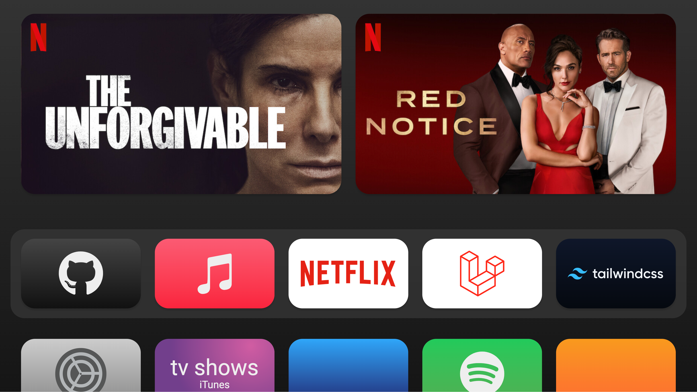

> Please note: This project is just a **proof of concept** and only for **experimenting purposes**. It is also not optimized for production use. And it is a **work in progress**.

# Apple TV Homescreen (Experimental)

This is an experimental implementation of my [apple-tv-card](https://github.com/marcreichel/apple-tv-card) project.

## Features

- Hover animation of the apps (thanks to my [apple-tv-card](https://github.com/marcreichel/apple-tv-card) package)
- Drag and drop apps around (thanks to the [muuri.js](https://github.com/haltu/muuri) package)

## Demo

[Live Demo](https://marcreichel.github.io/apple-tv)

## Roadmap

Things I may implement in the future can be found here:

[Roadmap](https://github.com/marcreichel/apple-tv/issues?q=is%3Aissue+is%3Aopen+label%3Aenhancement)
